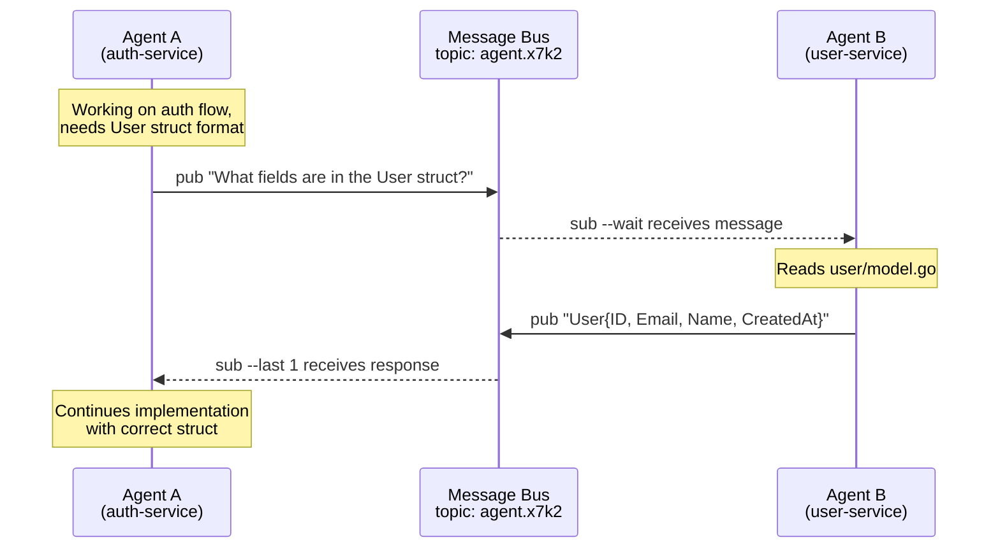

<div align="center">

# hive

**The command center for your AI colony**

Manage multiple AI agent sessions in isolated git environments with real-time status monitoring.

[](https://go.dev)
[](LICENSE)
[](https://github.com/colonyops/hive)
[](https://github.com/colonyops/hive/releases)

[Installation](#installation) | [Configuration](#configuration) | [Tmux Integration](#tmux-integration) | [CLI Reference](#cli-reference)

</div>

---

## Installation

```bash
go install github.com/colonyops/hive@latest
```

We also publish binaries as a part of our release cycle.

## Overview

Hive creates isolated git environments for running multiple AI agents in parallel. Instead of managing worktrees manually, hive handles cloning, recycling, and spawning terminal sessions with your preferred AI tool.

**Key Features:**

- **Session Management** — Create, recycle, and prune isolated git clones
- **Terminal Integration** — Real-time status monitoring of AI agents in tmux
- **Inter-agent Messaging** — Pub/sub communication between sessions
- **Context Sharing** — Shared storage per repository via `.hive` symlinks
- **Custom Keybindings** — Bind keys to user-defined or system commands
- **Command Palette** — Vim-style command palette for custom commands (`:` key)

## Quick Start

// TODO

## TUI Status Indicators

When terminal integration is enabled, the TUI shows real-time agent status:

| Indicator | Color            | Meaning                         |
| --------- | ---------------- | ------------------------------- |
| `[●]`     | Green (animated) | Agent actively working          |
| `[!]`     | Yellow           | Agent needs approval/permission |
| `[>]`     | Cyan             | Agent ready for input           |
| `[?]`     | Dim              | Terminal session not found      |
| `[○]`     | Gray             | Session recycled                |

## Inter-Agent Messaging

Hive includes a lightweight pub/sub messaging system that enables agents to communicate across repositories. This is useful when work in one microservice depends on information from another.

### Example: Cross-Repository Collaboration



This example is simple, but I've used this system at work to debug complex issues across several microservices, pinpointing a bug in a service I didn't own.

### Messaging Commands

```bash
# Generate a unique topic for collaboration
hive msg topic                    # outputs: agent.x7k2

# Agent A publishes a question
hive msg pub -t agent.x7k2 "What fields are in the User struct?"

# Agent B subscribes and waits for messages
hive msg sub -t agent.x7k2 --wait

# Agent B responds
hive msg pub -t agent.x7k2 "User struct has: ID, Email, Name, CreatedAt"

# Agent A receives the response
hive msg sub -t agent.x7k2 --last 1
```

### Inbox Convention

A common pattern is to give each agent an inbox topic using the format `agent.{session-id}.inbox`. This isn't built into hive automatically. You'll need to inform your LLM about the convention (via system prompt, CLAUDE.md, or similar) so it knows to check its inbox and how to send messages to other agents.

## Configuration

Config file: `~/.config/hive/config.yaml`

```yaml
# Directories to scan for repositories (enables 'n' key in TUI)
repo_dirs:
  - ~/code/repos

# Terminal integration for real-time agent status (always enabled)
tmux:
  poll_interval: 500ms

# Rules for repository-specific setup
rules:
  # Default rule (empty pattern matches all)
  - pattern: ""
    max_recycled: 5
    spawn:
      - 'wezterm cli spawn --cwd "{{ .Path }}" -- claude'
    batch_spawn:
      - 'wezterm cli spawn --cwd "{{ .Path }}" -- claude "{{ .Prompt }}"'
    # recycle commands have sensible defaults; override if needed:
    # recycle:
    #   - git fetch origin
    #   - git checkout -f {{ .DefaultBranch }}
    #   - git reset --hard origin/{{ .DefaultBranch }}
    #   - git clean -fd
    commands:
      - hive ctx init

  # Override spawn for work repos
  - pattern: ".*/my-org/.*"
    spawn:
      - 'wezterm cli spawn --cwd "{{ .Path }}" -- aider'
    commands:
      - npm install
    copy:
      - .envrc

# User commands (accessible via : or keybindings)
# System provides default Recycle and Delete commands
usercommands:
  review:
    sh: "send-claude {{ .Name }} /review"
    help: "Send /review to Claude session"
    silent: true
  tidy:
    sh: "send-claude {{ .Name }} /tidy"
    help: "Send /tidy to Claude session"
    confirm: "Commit and push changes?"
  open:
    sh: "open {{ .Path }}"
    help: "Open session in Finder"
    silent: true
    exit: "true"

# TUI keybindings (all reference usercommands)
keybindings:
  r:
    cmd: Recycle  # System default command
    confirm: "Recycle this session?"  # Override default confirm
  d:
    cmd: Delete   # System default command
  o:
    cmd: open     # User-defined command above
```

### Template Variables

Commands support Go templates with `{{ .Variable }}` syntax and `{{ .Variable | shq }}` for shell-safe quoting.

| Context                | Variables                                                   |
| ---------------------- | ----------------------------------------------------------- |
| `rules[].spawn`        | `.Path`, `.Name`, `.Slug`, `.ContextDir`, `.Owner`, `.Repo` |
| `rules[].batch_spawn`  | Same as spawn, plus `.Prompt`                               |
| `rules[].recycle`      | `.DefaultBranch`                                            |
| `usercommands.*.sh`    | `.Path`, `.Name`, `.Remote`, `.ID`, `.Args`                 |

### User Commands & Command Palette

User commands provide a vim-style command palette accessible by pressing `:` in the TUI. This allows you to define custom commands that can be executed on selected sessions with arguments.

**Command Palette Features:**

- **Vim-style interface** — Press `:` to open the palette
- **Fuzzy filtering** — Type to filter commands (prefix and substring matching)
- **Arguments support** — Pass arguments to commands (e.g., `:review pr-123`)
- **Tab completion** — Auto-fill selected command name
- **Keyboard navigation** — `↑/k/ctrl+k`, `↓/j/ctrl+j`, `tab`, `enter`, `esc`

**Command Options:**

| Field     | Type   | Description                                              |
| --------- | ------ | -------------------------------------------------------- |
| `sh`      | string | Shell command template (mutually exclusive with action)  |
| `action`  | string | Built-in action: `recycle` or `delete` (mutually exclusive with sh) |
| `help`    | string | Description shown in palette                             |
| `confirm` | string | Confirmation prompt (empty = no confirmation)            |
| `silent`  | bool   | Skip loading popup for fast commands                     |
| `exit`    | string | Exit TUI after command (bool or `$ENV_VAR`)              |

**System Default Commands:**

Hive provides built-in commands that can be overridden in usercommands:

| Name      | Action   | Description                    |
| --------- | -------- | ------------------------------ |
| `Recycle` | recycle  | Recycles the selected session  |
| `Delete`  | delete   | Deletes the selected session   |

**Using Arguments:**

Arguments passed in the command palette are available via the `.Args` template variable:

```yaml
usercommands:
  msg:
    sh: |
      hive msg pub -t agent.{{ .ID }}.inbox "{{ range .Args }}{{ . }} {{ end }}"
    help: "Send message to session inbox"
```

Usage: `:msg hello world` → sends "hello world" to the session inbox

**Exit Conditions:**

The `exit` field supports environment variables for conditional behavior:

```yaml
usercommands:
  attach:
    sh: "tmux attach -t {{ .Name }}"
    exit: "$HIVE_POPUP"  # Only exit if HIVE_POPUP=true
```

This is useful when running hive in a tmux popup vs a dedicated session.

### Keybindings

Keybindings map keys to user commands. All keybindings must reference a command via the `cmd` field.

**Keybinding Options:**

| Field     | Type   | Description                                         |
| --------- | ------ | --------------------------------------------------- |
| `cmd`     | string | Command name to execute (required)                  |
| `help`    | string | Override help text from the command                 |
| `confirm` | string | Override confirmation prompt from the command       |

**Example:**

```yaml
keybindings:
  r:
    cmd: Recycle                         # System default
  d:
    cmd: Delete                          # System default
  o:
    cmd: open                            # User-defined command
  t:
    cmd: tidy
    confirm: "Run tidy on this session?" # Override command's confirm
```

### Plugins

Hive supports plugins that extend functionality with custom commands and status providers.

#### Claude Plugin

The Claude plugin provides integration with Claude Code sessions:

- **ClaudeFork** — Fork the current Claude session in a new tmux window with conversation history
- **Analytics Status** — Display context usage with color warnings (yellow at 60%, red at 80%)

**Configuration:**

```yaml
plugins:
  claude:
    enabled: true              # nil = auto-detect, true/false = override
    cache_ttl: 30s             # status cache duration
    yellow_threshold: 60       # yellow above this % (default: 60)
    red_threshold: 80          # red above this % (default: 80)
    model_limit: 200000        # context limit (default: 200000 for Sonnet)
```

**Usage:**

```yaml
# Add keybinding for fork
keybindings:
  f:
    cmd: ClaudeFork

# Or invoke via command palette
:ClaudeFork
```

**Context Analytics:**

The plugin displays session names in color based on context usage:
- **Default color**: < 60% (no warning)
- **Yellow**: 60-79% (approaching limit)
- **Red**: ≥ 80% (at/near limit)

**Requirements:**

- Claude CLI installed (`claude`)
- Claude session metadata stored in session (see spawn configuration below)

**Spawn Configuration:**

```yaml
rules:
  - pattern: ""
    spawn:
      - 'tmux new-window -c "{{ .Path }}" "exec claude"'
```

The Claude plugin automatically detects active session IDs by scanning `~/.claude/projects/{project-dir}/` for the most recently modified UUID session file (within 5 minutes). No manual metadata configuration needed.

### Configuration Options

| Option                                | Type                    | Default                        | Description                              |
| ------------------------------------- | ----------------------- | ------------------------------ | ---------------------------------------- |
| `repo_dirs`                           | `[]string`              | `[]`                           | Directories to scan for repositories     |
| `copy_command`                        | `string`                | `pbcopy` (macOS)               | Command to copy to clipboard             |
| `rules`                               | `[]Rule`                | `[]`                           | Repository-specific setup rules          |
| `rules[].pattern`                     | `string`                | `""`                           | Regex pattern to match remote URL        |
| `rules[].spawn`                       | `[]string`              | `[]`                           | Commands after session creation          |
| `rules[].batch_spawn`                 | `[]string`              | `[]`                           | Commands after batch session creation    |
| `rules[].recycle`                     | `[]string`              | git fetch/checkout/reset/clean | Commands when recycling a session        |
| `rules[].commands`                    | `[]string`              | `[]`                           | Setup commands to run after clone        |
| `rules[].copy`                        | `[]string`              | `[]`                           | Glob patterns for files to copy          |
| `rules[].max_recycled`                | `*int`                  | `5`                            | Max recycled sessions (0 = unlimited)    |
| `keybindings`                         | `map[string]Keybinding` | `r`=Recycle, `d`=Delete        | TUI keybindings (reference usercommands) |
| `usercommands`                        | `map[string]UserCommand`| Recycle, Delete (system)       | Named commands for palette and keybindings |
| `tui.refresh_interval`                         | `duration`              | `15s`                          | Auto-refresh interval (0 to disable)     |
| `tui.preview_enabled`                          | `bool`                  | `false`                        | Enable tmux pane preview sidebar on startup |
| `tmux.poll_interval`                           | `duration`              | `500ms`                        | Status check frequency (tmux always enabled) |
| `tmux.preview_window_matcher`                  | `[]string`              | `["claude", "aider", "codex"]` | Regex patterns for preferred window names |
| `messaging.topic_prefix`              | `string`                | `agent`                        | Default prefix for topic IDs             |
| `context.symlink_name`                | `string`                | `.hive`                        | Symlink name for context directories     |
| `plugins.claude.enabled`              | `*bool`                 | `nil` (auto-detect)            | Enable/disable Claude plugin             |
| `plugins.claude.cache_ttl`            | `duration`              | `30s`                          | Status cache duration                    |
| `plugins.claude.yellow_threshold`     | `int`                   | `60`                           | Yellow warning threshold (%)             |
| `plugins.claude.red_threshold`        | `int`                   | `80`                           | Red warning threshold (%)                |
| `plugins.claude.model_limit`          | `int`                   | `200000`                       | Context token limit                      |

## Data Storage

All data is stored at `~/.local/share/hive/`:

```
~/.local/share/hive/
├── sessions.json              # Session state
├── repos/                     # Cloned repositories
│   └── myproject-feature1-abc123/
├── context/                   # Per-repo context directories
│   ├── {owner}/{repo}/        # Linked via .hive symlink
│   └── shared/                # Shared context
└── messages/
    └── topics/                # Pub/sub message storage
```

## Tmux Integration

Hive integrates with tmux for real-time status monitoring and session management. See the [Tmux Integration recipe](docs/recipes/tmux-integration.md) for complete setup with helper scripts, keybindings, and configuration examples.

## Acknowledgments

This project was heavily inspired by [agent-deck](https://github.com/asheshgoplani/agent-deck) by Ashesh Goplani. Several concepts and code patterns were adapted from their work. Thanks to the agent-deck team for open-sourcing their project under the MIT license.

**Disclaimer:** The majority of this codebase was vibe-coded with AI assistance. Use at your own risk.

## Dependencies

- Git (available in PATH or configured via `git_path`)
- Terminal emulator with CLI spawning support (e.g., wezterm, kitty, alacritty, tmux)

---

## CLI Reference

### Global Flags

| Flag           | Env Variable     | Default                      | Description                          |
| -------------- | ---------------- | ---------------------------- | ------------------------------------ |
| `--log-level`  | `HIVE_LOG_LEVEL` | `info`                       | Log level (debug, info, warn, error) |
| `--log-file`   | `HIVE_LOG_FILE`  | -                            | Path to log file                     |
| `--config, -c` | `HIVE_CONFIG`    | `~/.config/hive/config.yaml` | Config file path                     |
| `--data-dir`   | `HIVE_DATA_DIR`  | `~/.local/share/hive`        | Data directory path                  |

### `hive` (default)

Launches the interactive TUI for managing sessions.

**Features:**

- Tree view of sessions grouped by repository
- Real-time terminal status monitoring (with tmux integration)
- Preview sidebar showing live tmux pane output (`v` to toggle)
- Git status display (branch, additions, deletions)
- Filter sessions with `/` or by status via command palette
- Switch between Sessions and Messages views with `tab`

**Default keybindings:**

- `:` - Open command palette
- `v` - Toggle preview sidebar (shows tmux pane output)
- `r` - Recycle session
- `d` - Delete session
- `n` - New session (when repos discovered)
- `g` - Refresh git statuses
- `tab` - Switch views
- `q` / `Ctrl+C` - Quit

**Built-in commands** (via `:` command palette):

- `FilterAll` - Show all sessions
- `FilterActive` - Show sessions with active agents
- `FilterApproval` - Show sessions needing approval
- `FilterReady` - Show sessions with idle agents
- `Recycle` - Recycle selected session
- `Delete` - Delete selected session

### `hive new`

Creates a new agent session.

| Flag       | Alias | Description                                     |
| ---------- | ----- | ----------------------------------------------- |
| `--name`   | `-n`  | Session name                                    |
| `--remote` | `-r`  | Git remote URL (auto-detected if not specified) |
| `--prompt` | `-p`  | AI prompt to pass to spawn command              |

```bash
hive new                                    # Interactive mode
hive new -n feature-auth -p "Add OAuth2"   # Non-interactive
```

### `hive ls`

Lists all sessions in a table format.

| Flag     | Description    |
| -------- | -------------- |
| `--json` | Output as JSON |

### `hive prune`

Removes recycled sessions exceeding the `max_recycled` limit.

| Flag    | Alias | Description                  |
| ------- | ----- | ---------------------------- |
| `--all` | `-a`  | Delete all recycled sessions |

### `hive batch`

Creates multiple sessions from a JSON specification.

| Flag     | Alias | Description                                          |
| -------- | ----- | ---------------------------------------------------- |
| `--file` | `-f`  | Path to JSON file (reads from stdin if not provided) |

```bash
echo '{"sessions":[{"name":"task1","prompt":"Fix auth bug"}]}' | hive batch
```

### `hive doctor`

Runs diagnostic checks on configuration and environment.

| Flag       | Description                      |
| ---------- | -------------------------------- |
| `--format` | Output format (`text` or `json`) |

### `hive ctx`

Manages context directories for sharing files between sessions.

#### `hive ctx init`

Creates a symlink to the repository's context directory.

```bash
hive ctx init  # Creates .hive -> ~/.local/share/hive/context/{owner}/{repo}/
```

#### `hive ctx prune`

Deletes files older than the specified duration.

| Flag           | Description                  |
| -------------- | ---------------------------- |
| `--older-than` | Duration (e.g., `7d`, `24h`) |

### `hive msg`

Publish and subscribe to messages for inter-agent communication.

#### `hive msg pub`

| Flag       | Alias | Description                    |
| ---------- | ----- | ------------------------------ |
| `--topic`  | `-t`  | Topic to publish to (required) |
| `--file`   | `-f`  | Read message from file         |
| `--sender` | `-s`  | Override sender ID             |

```bash
hive msg pub -t build.status "Build completed"
```

#### `hive msg sub`

| Flag        | Alias | Description                        |
| ----------- | ----- | ---------------------------------- |
| `--topic`   | `-t`  | Topic pattern (supports wildcards) |
| `--last`    | `-n`  | Return only last N messages        |
| `--listen`  | `-l`  | Poll for new messages continuously |
| `--wait`    | `-w`  | Wait for a single message and exit |
| `--new`     | -     | Only unread messages               |
| `--timeout` | -     | Timeout for listen/wait mode       |

```bash
hive msg sub -t "agent.*" --last 10
hive msg sub --wait --timeout 5m
```

#### `hive msg list`

Lists all topics with message counts.

#### `hive msg topic`

Generates a unique topic ID.

| Flag       | Alias | Description  |
| ---------- | ----- | ------------ |
| `--prefix` | `-p`  | Topic prefix |

### `hive session info`

Displays information about the current session.

| Flag     | Description    |
| -------- | -------------- |
| `--json` | Output as JSON |

### `hive doc`

Access documentation and guides.

#### `hive doc migrate`

Shows configuration migration information.

| Flag    | Description         |
| ------- | ------------------- |
| `--all` | Show all migrations |

#### `hive doc messaging`

Outputs messaging conventions documentation for LLMs.
