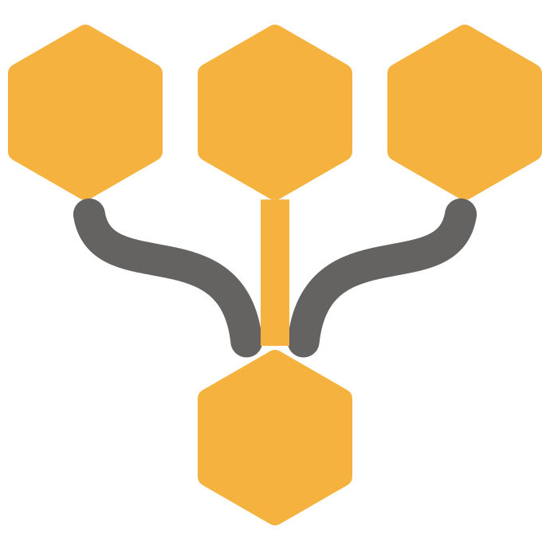

<div align="center">



# hive

**The command center for your AI colony**

Manage multiple AI agent sessions in isolated git environments with real-time status monitoring.

[](https://go.dev)
[](LICENSE)
[](https://github.com/colonyops/hive)
[](https://github.com/colonyops/hive/releases)

[Documentation](https://hivedesktop.com/cli/) | [Getting Started](https://hivedesktop.com/cli/getting-started/) | [Configuration](https://hivedesktop.com/cli/configuration/) | [Contributing](#contributing)

</div>

---

This repository holds two programs on one session engine:

- **hive**, the CLI/TUI documented below (`cmd/hive`).
- **Hive Desktop**, a desktop app with an inbox that collects pull requests, issues, and alerts into feeds, a Code area for the same sessions, and agent chat workspaces (`cmd/desktop`). Download it and read its docs at [hivedesktop.com](https://hivedesktop.com/desktop/getting-started/).

## Installation

```bash
brew install tmux
brew install colonyops/tap/hive
```

Or install directly with Go:

```bash
go install github.com/colonyops/hive@latest
```

Pre-built binaries are also available on the [GitHub Releases](https://github.com/colonyops/hive/releases) page.

## Overview

Hive manages isolated git sessions for running AI agents in parallel. Instead of manually managing git worktrees or directories, hive handles cloning, recycling, and spawning terminal sessions with your preferred AI tool (Claude, Aider, Codex).

Each hive session is a complete git clone in a dedicated directory with its own terminal environment. Sessions are tracked through a lifecycle (active → recycled → deleted) and can be reused, reducing clone time and disk usage.

**Key Features:**

- **Session Management** — Create, recycle, and prune isolated git clones
- **Terminal Integration** — Real-time status monitoring of AI agents in tmux (works out of the box)
- **Task Tracking** — Built-in epics and tasks for multi-agent coordination (`hive hc`)
- **Inter-agent Messaging** — Pub/sub communication between sessions
- **Context Sharing** — Shared storage per repository via `.hive` symlinks
- **Operator Todos (Experimental)** — Track human follow-up items from agents via CLI/TUI todo flows
- **Custom Keybindings** — Bind keys to user-defined or system commands
- **Command Palette** — Vim-style command palette for custom commands (`:` key)

## Quick Start

**Prerequisites:** Git and tmux installed.

```bash
hive init   # interactive setup wizard — alias, config, tmux binding
hv          # launch
```

`hive init` detects installed AI agents, scaffolds `~/.config/hive/config.yaml`, appends an `hv` alias to your shell rc, and adds a tmux keybinding to jump back to hive.

Press `n` to create sessions, `enter` to open them, and `:` for the command palette.

See the [Getting Started guide](https://hivedesktop.com/cli/getting-started/) for full setup instructions.

## Status Indicators

| Indicator | Color            | Meaning                         |
| --------- | ---------------- | ------------------------------- |
| `[●]`     | Green (animated) | Agent actively working          |
| `[!]`     | Yellow           | Agent needs approval/permission |
| `[>]`     | Cyan             | Agent ready for input           |
| `[?]`     | Dim              | Terminal session not found      |
| `[○]`     | Gray             | Session recycled                |

## Documentation

Full documentation is available at **[hivedesktop.com/cli](https://hivedesktop.com/cli/)**.

- [Getting Started](https://hivedesktop.com/cli/getting-started/) — Terminology, quick start, first session
- [Configuration](https://hivedesktop.com/cli/configuration/) — Config file, rules, templates, options
- [User Commands](https://hivedesktop.com/cli/configuration/commands/) — User commands and command palette
- [Keybindings](https://hivedesktop.com/cli/configuration/keybindings/) — Key mappings and palette commands
- [Task Tracking](https://hivedesktop.com/cli/getting-started/task-tracking/) — Built-in epics and tasks for multi-agent coordination
- [Messaging](https://hivedesktop.com/cli/getting-started/messaging/) — Inter-agent pub/sub communication
- [Todos (Experimental)](https://hivedesktop.com/cli/getting-started/todos/) — Operator todo lifecycle and CLI usage
- [Plugins](https://hivedesktop.com/cli/configuration/plugins/) — Claude, tmux, and other plugins
- [Themes](https://hivedesktop.com/cli/configuration/themes/) — Built-in themes and custom palettes
- [Context & Review](https://hivedesktop.com/cli/getting-started/context/) — Shared context directories and review tool
- [FAQ](https://hivedesktop.com/cli/faq/) — Common questions

## Dependencies

- Git (available in PATH or configured via `git_path`)
- tmux (required — provides session management and status monitoring)

## Contributing

See [CONTRIBUTING.md](CONTRIBUTING.md). [docs/development.md](docs/development.md) covers setup, the repository layout, running each program, and the quality gates.

## Acknowledgments

This project was heavily inspired by [agent-deck](https://github.com/asheshgoplani/agent-deck) by Ashesh Goplani. Several concepts and code patterns were adapted from their work. Thanks to the agent-deck team for open-sourcing their project under the MIT license.

**Disclaimer:** The majority of this codebase was vibe-coded with AI assistance. Use at your own risk.
