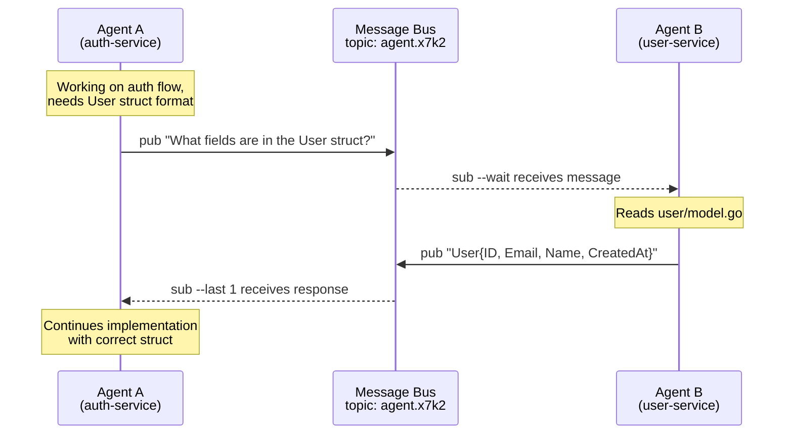

# Inter-Agent Messaging

Hive includes a lightweight pub/sub messaging system that enables agents to communicate across repositories. This is useful when work in one microservice depends on information from another.

## Inbox Convention

Each hive session has a conventional inbox topic using the format `agent.{session-id}.inbox`. This convention makes it easy for agents to find each other's inboxes and send direct messages.

**Example**:

- Session ID: `26kj0c`
- Inbox topic: `agent.26kj0c.inbox`

You can find your current session ID and inbox with:

```bash
hive session info
```

**Note**: The `agent.` prefix refers to the AI agent running in the session, not the session itself. In the future when hive supports multiple agents per session, inbox addressing will use `agent.<session-id>.<agent-name>.inbox`.

## Example: Cross-Repository Collaboration



This example is simple, but I've used this system at work to debug complex issues across several microservices, pinpointing a bug in a service I didn't own.

## Messaging Commands

```bash
# Generate a unique topic for collaboration
hive msg topic                    # outputs: agent.x7k2

# Agent A publishes a question
hive msg pub -t agent.x7k2 "What fields are in the User struct?"

# Agent B subscribes and waits for messages
hive msg sub -t agent.x7k2 --wait

# Agent B responds
hive msg pub -t agent.x7k2 "User struct has: ID, Email, Name, CreatedAt"

# Agent A receives the response
hive msg sub -t agent.x7k2 --last 1
```

## CLI Reference

See the full [messaging CLI reference](../cli-reference.md#hive-msg) for all flags and options.
