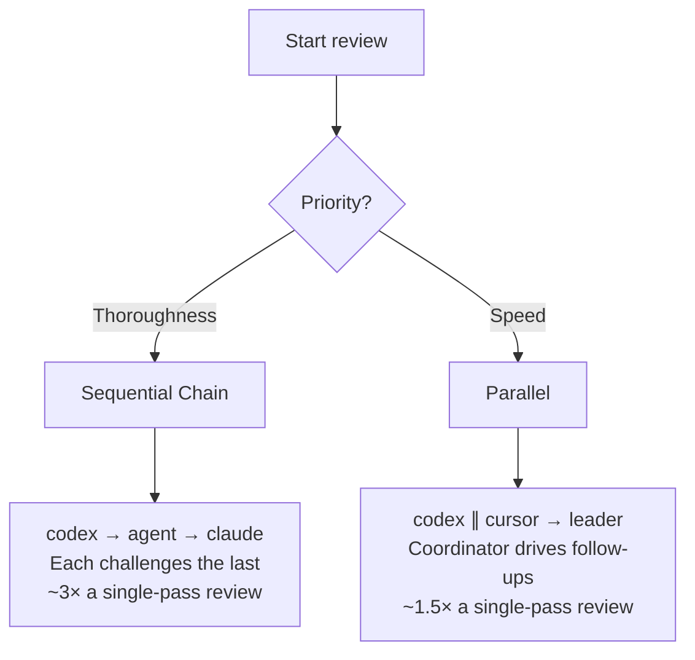

# Recipes

Practical guides for common hive workflows and integrations.

## Code Review

Two multi-agent review patterns using hive's tmux window spawning and messaging primitives. Both open a dedicated set of windows on the current session — no separate session needed.

| Recipe | Pattern | Best for |
|---|---|---|
| [Sequential Chain Review](sequential-chain-review.md) | Serial — each agent reads and challenges the previous | Thorough adversarial analysis, surfacing contradictions |
| [Parallel Code Review](parallel-code-review.md) | Parallel specialists + coordinator | Faster feedback, iterative follow-up rounds |

### Which to use?

**Sequential** is better when you want an adversarial pipeline: the second reviewer is explicitly asked to refute the first, and the third is asked to challenge both. Contradictions between reviewers get resolved rather than buried.

**Parallel** is better when you want fast results with active coordination: both specialists work at once, and the leader drives targeted follow-up questions rather than just receiving a dump of findings.

---

- [Inter-Agent Code Review](inter-agent-code-review.md) — Async single-reviewer pattern using inbox messaging
