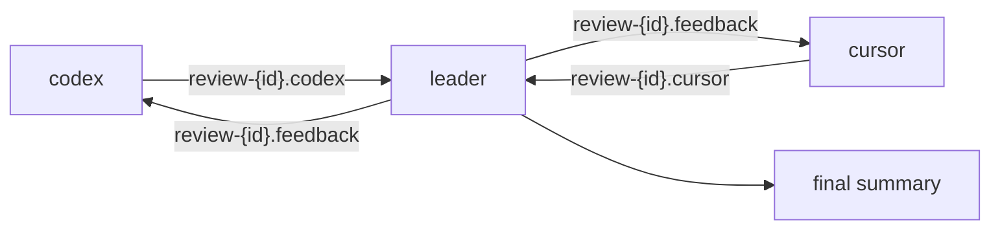

# Parallel Code Review

A coordinator agent (claude) directs two specialist agents (codex and cursor) that run concurrently. The coordinator waits for both first-pass reports, identifies gaps, and sends targeted follow-up questions for another round — iterating until satisfied, then producing a final summary.

## How it works



**Key characteristics:**

- **Parallel** — codex and cursor run simultaneously; total time is dominated by the slower of the two, not their sum
- **Iterative** — the coordinator drives multiple rounds of targeted follow-up questions
- **Specialist split** — codex focuses on correctness/quality, cursor on security/architecture
- **Best for:** fast feedback with active human-like coordination, especially on larger diffs

Compare with [Sequential Chain Review](sequential-chain-review.md), which chains three agents in strict order and is better suited to adversarial analysis where you want reviewers to explicitly challenge each other.

## Config

Add to `~/.config/hive/config.yaml`:

```yaml
usercommands:
  CodeReview:
    help: "parallel multi-agent review: codex + cursor coordinated by claude"
    silent: true
    windows:
      - name: leader
        focus: true
        command: |-
          {{ agentCommand }} {{ agentFlags }} 'You are coordinating a code review of the
          current branch changes.

          Two specialist agents are running in parallel in this session:
          - codex  publishes findings to: review-{{ .ID }}.codex
          - cursor publishes findings to: review-{{ .ID }}.cursor

          Your workflow:
          1. Understand the changes under review:
             git diff main...HEAD   (branch commits)
             git diff               (unstaged changes)
          2. Wait for both agents to complete their first pass:
             hive msg sub --topic review-{{ .ID }}.codex --wait
             hive msg sub --topic review-{{ .ID }}.cursor --wait
          3. Read their findings. Identify gaps, contradictions, and areas needing deeper
             investigation.
          4. Send targeted follow-up questions to each agent:
             hive msg pub --topic review-{{ .ID }}.feedback "your questions"
          5. Wait for updated responses and repeat steps 2-4 until satisfied.
          6. Produce a final written summary of all findings.'

      - name: codex
        command: |-
          codex 'You are reviewing code changes for correctness and quality.

          Your workflow:
          1. Read all changes under review:
             git diff main...HEAD   (branch commits)
             git diff               (unstaged changes)
          2. Analyse for logic correctness, error handling, naming, test coverage, and
             API design.
          3. Publish your findings:
             hive msg pub --topic review-{{ .ID }}.codex "your findings"
          4. Wait for follow-up from the leader:
             hive msg sub --topic review-{{ .ID }}.feedback --wait
          5. Address the follow-up, publish an updated report to the same topic, then wait
             again.
          Repeat steps 4-5 until no further feedback arrives.'

      - name: cursor
        command: |-
          agent 'You are reviewing code changes for security and architecture.

          Your workflow:
          1. Read all changes under review:
             git diff main...HEAD   (branch commits)
             git diff               (unstaged changes)
          2. Analyse for security issues, architectural concerns, dependency risks, and
             design patterns.
          3. Publish your findings:
             hive msg pub --topic review-{{ .ID }}.cursor "your findings"
          4. Wait for follow-up from the leader:
             hive msg sub --topic review-{{ .ID }}.feedback --wait
          5. Address the follow-up, publish an updated report to the same topic, then wait
             again.
          Repeat steps 4-5 until no further feedback arrives.'
```

!!! note "Shell quoting"
    The `'"'"'` sequences in the commands are the POSIX shell idiom for embedding a literal single quote inside a single-quoted string (end quote → literal `'` → reopen quote). They appear as an apostrophe in the prompt text that the agents receive.

## Template variables

| Variable | Value |
|---|---|
| `{{ .ID }}` | Session ID (6-char alphanumeric) — used as a unique namespace for topics |
| `{{ agentCommand }}` | The configured agent binary (e.g. `claude`) |
| `{{ agentFlags }}` | Any extra flags from the agent profile |

`{{ .ID }}` ensures topic names are shell-safe even when session display names contain spaces or slashes.

## Usage

In the hive TUI, select your working session and press `:`:

```
:CodeReview
```

Three tmux windows open in the current session. The `leader` window is focused — it will display coordination activity and the final summary. The `codex` and `cursor` windows each start reviewing immediately in parallel; the `leader` blocks until it receives both first-pass reports on their respective topics.

## Customisation

**Swap the specialist tools** — replace `codex` or `agent` in the window commands with any CLI reviewer.

**Add a third specialist** — add a fourth window, give it a unique topic (e.g. `review-{{ .ID }}.perf`), update the leader prompt to include it in the wait list and feedback loop.

**One-shot mode** — remove steps 4–5 from the specialist prompts and the loop from the leader prompt to do a single pass without follow-up rounds.
