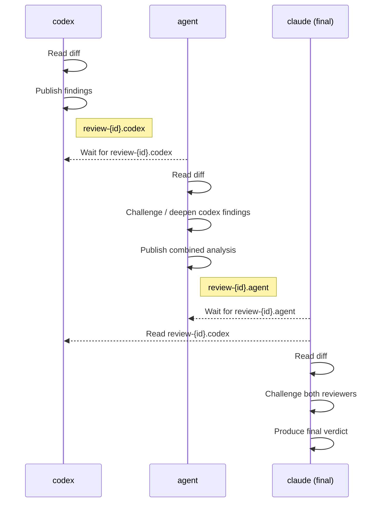

# Sequential Chain Review

Three agents review the same diff in strict order — each one reads and challenges the previous reviewer's findings before writing its own report. The final agent produces a verdict that synthesises and stress-tests all prior analysis.

## How it works



**Key characteristics:**

- **Serial** — each stage blocks on the previous; total time is the sum of all three passes
- **Adversarial** — each reviewer is explicitly instructed to challenge the one before it
- **Accumulating context** — the final reviewer has both earlier reports plus the raw diff
- **Best for:** thorough pre-merge review where you want contradictions surfaced and resolved

Compare with [Parallel Code Review](parallel-code-review.md), which runs specialist agents simultaneously and is better suited to faster, iterative feedback.

## Config

Add to `~/.config/hive/config.yaml`:

```yaml
usercommands:
  ReviewCodeSync:
    help: "sequential chain review: codex → agent → claude"
    silent: true
    windows:
      - name: codex
        command: |-
          codex 'You are the first reviewer in a sequential code review chain.

          Your workflow:
          1. Read all changes under review:
             git diff main...HEAD   (branch commits)
             git diff               (unstaged changes)
          2. Analyse thoroughly for: logic correctness, error handling, edge cases, naming
             clarity, test coverage, API design, and any potential bugs.
          3. Publish your complete findings:
             hive msg pub --topic review-{{ .ID }}.codex "your detailed findings"

          Be thorough. The next reviewer will read your report and challenge it.'

      - name: agent
        command: |-
          agent 'You are the second reviewer in a sequential code review chain.

          Your workflow:
          1. Wait for the first reviewer (codex) to finish:
             hive msg sub --topic review-{{ .ID }}.codex --wait --timeout 2h
          2. Read all changes under review:
             git diff main...HEAD   (branch commits)
             git diff               (unstaged changes)
          3. Read codex'"'"'s findings from step 1.
          4. Analyse for: security vulnerabilities, architectural concerns, design pattern
             misuse, dependency risks, concurrency issues, and anything codex may have
             missed or misjudged.
          5. For each of codex'"'"'s findings: agree, refute, or deepen it with evidence
             from the diff.
          6. Publish your combined analysis:
             hive msg pub --topic review-{{ .ID }}.agent "your analysis"

          Be critical. Do not simply restate what codex said.'

      - name: claude
        focus: true
        command: |-
          {{ agentCommand }} {{ agentFlags }} 'You are the final reviewer in a sequential
          code review chain. Your job is to be ruthlessly critical.

          Your workflow:
          1. Wait for the second reviewer (agent) to finish:
             hive msg sub --topic review-{{ .ID }}.agent --wait --timeout 2h
          2. Read codex'"'"'s findings:
             hive msg sub --topic review-{{ .ID }}.codex
          3. Read agent'"'"'s findings from step 1.
          4. Read all changes under review:
             git diff main...HEAD   (branch commits)
             git diff               (unstaged changes)
          5. Produce the final verdict. You must:
             - Challenge every finding from both reviewers: demand evidence, reject vague claims
             - Identify issues NEITHER reviewer caught
             - Call out where the two reviewers contradict each other and resolve it
             - Rank all issues by severity (critical / major / minor)
             - Give a clear ship / do not ship recommendation with specific conditions

          Be adversarial. Assume the previous reviewers missed things.'
```

!!! note "Shell quoting"
    The `'"'"'` sequences in the commands are the POSIX shell idiom for embedding a literal single quote inside a single-quoted string (end quote → literal `'` → reopen quote). They appear as an apostrophe in the prompt text that codex, agent, and claude receive.

## Template variables

| Variable | Value |
|---|---|
| `{{ .ID }}` | Session ID (6-char alphanumeric) — used as a unique namespace for topics |
| `{{ agentCommand }}` | The configured agent binary (e.g. `claude`) |
| `{{ agentFlags }}` | Any extra flags from the agent profile |

`{{ .ID }}` ensures topic names are shell-safe even when session display names contain spaces or slashes.

## Usage

In the hive TUI, select your working session and press `:`:

```
:ReviewCodeSync
```

Three tmux windows open in the current session: `codex` starts immediately, `agent` and `claude` each block on a messaging subscription until their predecessor publishes. The `claude` window is focused — it will display the final verdict when both earlier stages complete.

## Customisation

**Change the second reviewer tool** — replace `agent` with any CLI tool in the `agent` window command.

**Adjust timeout** — `--timeout 2h` on the `hive msg sub --wait` calls controls how long each stage waits before giving up.

**Add a fourth stage** — publish from the claude window to a new topic and add a fourth window that subscribes to it.
